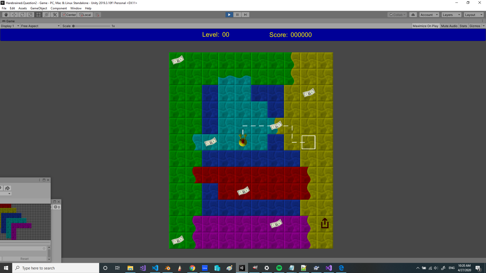
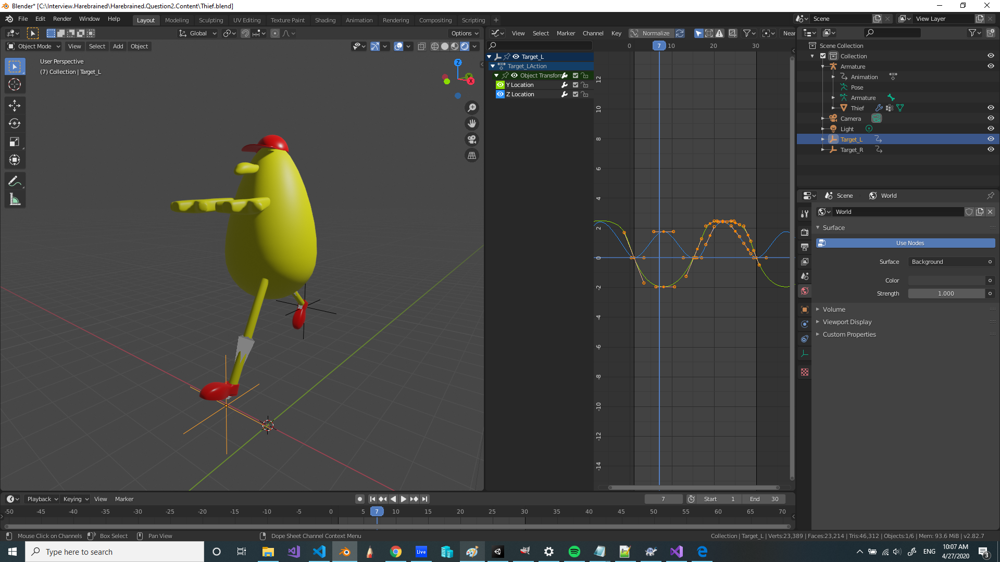
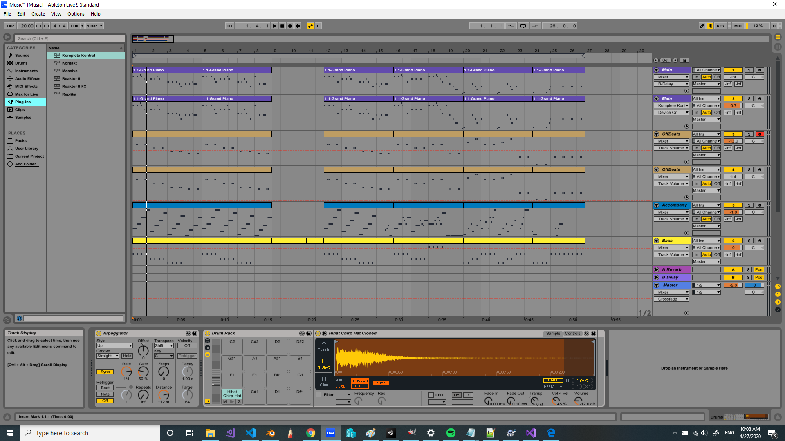

# I made this for a job interview challenge...

## Jewel Thief REMAKE!!!

When I read the interview assigment, [this game from 1997](https://youtu.be/hy9X3ru9YeI) immediately popped into my head for some reason. So I started remaking it, and I had so much fun with it, I just had to keep the project going the way it did!

I remade most of the assets in the game and reworked the controls to fit the assignment better, and created 19 of the original levels sourced from that YouTube video I linked.

Also, I haven't used Unity that much before! I wanted to see what I could do in such a short time, and I thought that might be interesting for both of us.

## How to Play



### Premise
Use the mouse to guide your thief to the treasure! You can only move 6 spaces out. However, you may teleport to a grid space of the same color you are on if you are blocked. Each teleport only counts as 1 space, regardless of how far you jump.

### Crossing Colors

You may cross into another color, but only if the tile is also *partially* colored in your current color. A tile may also have up to 4 different colors on it.

### Advancing Levels

Collect all the jewelry in the level, and then proceed to the exit once it lights up.

### Losing The Game

Starting in Level 2, your nemesis thief enters play! The only way you can lose is if the other thief gets to the exit before you do. So pay attention! And if you are not sure if you can get the gem without losing, just let the other thief get it and go camp by the exit until it's open!

## Relevant Code

I would recommend you play the game first, so you understand how the grid system works before jumping in. The code portion that covers the assignment is in:
```
Assets/Scripts/BehaviorComponents/DijkstraWeightGraph.cs
```
And the Unit tests are in: 
```
Assets/Editor/Tests/DijikstraTests.cs
```

But there's a lot of other stuff in the project you can check out. The system that feeds the data into Dijikstra is also a complicated system. It's: `LogicalCellGraph`. It takes a standard grid and calculates adjacent accessible neighbors to every node, but in this case I don't mean physically adjacent, because there is teleportation involved in the gameplay.

## Learnings/Challenges

I touched on a lot of Unity docs during this time. Besides just learning the basics, I created & imported an awful..ly great-looking 3d model because I can't draw, and started tickling Unity's rendering engine a little bit.


### My Custom Line Renderer

Unity's line renderer only supported one continuous shape. I didn't want to add new line renderers to new objects, so I wrote my own line renderer. And it was surprisingly easy!

### Tile Palette
My favorite Unity tool was the tile palette!!! It suited my needs so perfectly, I was able to bang out the 20 levels in just a few hours. I could do the other 20 but my clicking finger is sore.

### Object Trouble
I had some run-ins with their game object system! At first I wasn't sure what the spawn order was for everything, so making the systems across different objects talk was a bit time consuming, but I think I got it figured out. I started grouping the levels hierarchically and that helped a lot with some of the scene management, but I kept dragging object references into component parameter slots for the most part because I'm used to the explicitness of it as a programmer.

### Prefab-ilicious
I didn't discover how powerful prefabs were until late into my 3 day project, though. I really wish I added the pickup items as prefabs so I could group them easier.

### Animatorrrrrr
I used the Animator to blend between idle and run clips, which was really fun. I can totally see how that could work on a big project.

## Fun Stuff





This is me remaking the music, in all it's 1997 glory! And the character walk cycle, of course! True to the original.